# Matriculas Provinciales \# - Numéricas de España v1.0
Sistema provincial numérico usado entre octubre de 1900 y octubre de 1971. Compuesto por una, dos o tres letras representando la provincia y hasta seis números sin ceros a la izquierda*

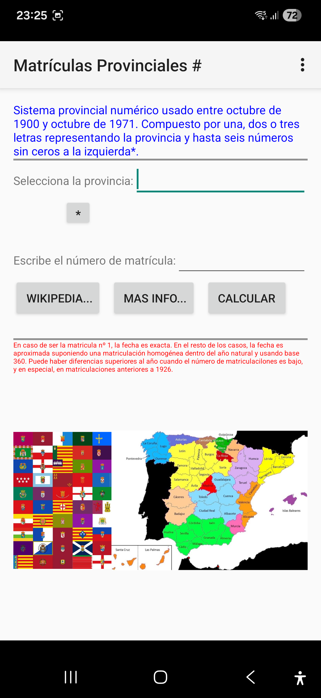

Web: <a href="http://prosselloe.wordpress.com">prosselloe.wordpress.com</a> - 
<a href="https://es.wikipedia.org/wiki/Matr%C3%ADculas_automovil%C3%ADsticas_de_Espa%C3%B1a#Sistema_provincial_num%C3%A9ricol">Wikipedia</a> - 
<a href="http://www.sme-matriculas.es/up1.html">Mas información</a> -
E-mail: <a href="mailto:prosselloe@gmail.com">prosselloe@gmail.com</a> - 
© prosselloe 2019 

*En caso de ser la matrícula nº 1, la fecha es exacta. En el resto de los casos, la fecha es aproximada suponiendo una matriculación homogenea dentro del año natural y usando base 360. Puede haber diferencias superiores al año cuando el número de matriculaciones es bajo, y en especial, en matriculaciones anteriores a 1926.

<table>
  <tr>
    <td>Álava
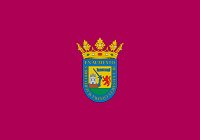</td>
    <td>Albacete
</td>
    <td>Alicante
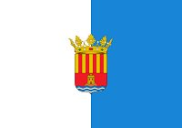</td>
    <td>Almería
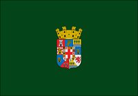</td>
  </tr>
  <tr>
    <td>Asturias
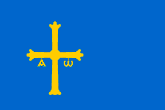</td>
    <td>Avila
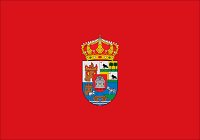</td>
    <td>Badajoz
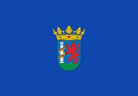</td>
    <td>Baleares
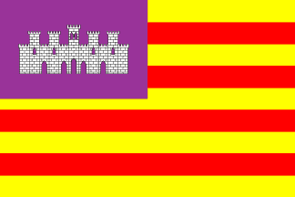</td>
  </tr>
  <tr>
    <td>Barcelona
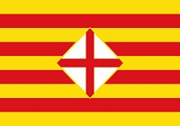</td>
    <td>Burgos
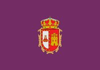</td>
    <td>Cáceres
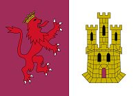</td>
    <td>Cadiz
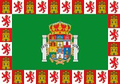</td>
  </tr>
  <tr>
    <td>Cantabria
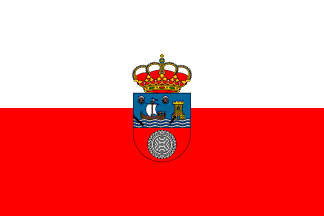</td>
    <td>Castellón
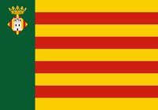</td>
    <td>Ceuta
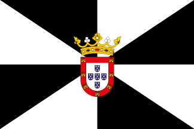</td>
    <td>Ciudad Real
</td>
  </tr>
  <tr>
    <td>Córdoba
</td>
    <td>Coruña, La
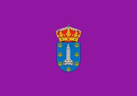</td>
    <td>Cuenca
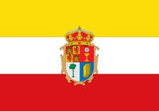</td>
    <td>Gerona
</td>
  </tr>
  <tr>
    <td>Granada
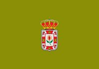</td>
    <td>Guadalajara
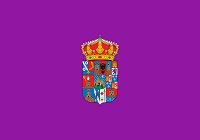</td>
    <td>Guipúzcoa
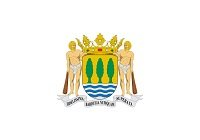</td>
    <td>Huelva
</td>
  </tr>
  <tr>
    <td>Huesca
</td>
    <td>Jaén
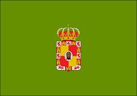</td>
    <td>León
</td>
    <td>Lérida
</td>
  </tr>
  <tr>
    <td>Lugo
</td>
    <td>Madrid
</td>
    <td>Málaga
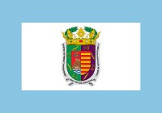</td>
    <td>Melilla
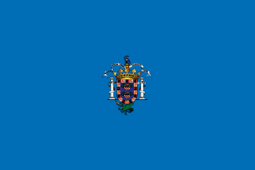</td>
  </tr>
  <tr>
    <td>Murcia
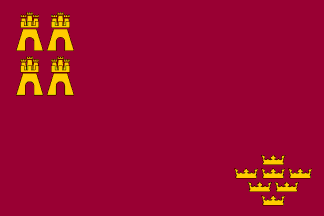</td>
    <td>Navarra
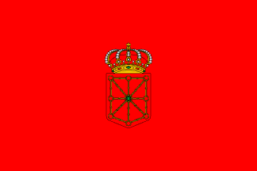</td>
    <td>Orense
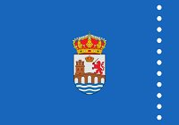</td>
    <td>Palencia
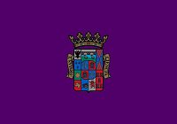</td>
  </tr>
  <tr>
    <td>Palmas, Las
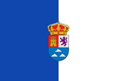</td>
    <td>Pontevedra
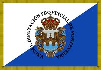</td>
    <td>Rioja, La
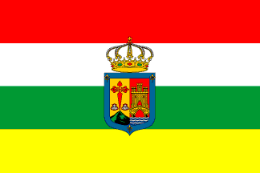</td>
    <td>Salamanca
</td>
  </tr>
  <tr>
    <td>Tenerife
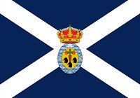</td>
    <td>Segovia
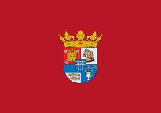</td>
    <td>Sevilla
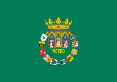</td>
    <td>Soria
</td>
  </tr>
  <tr>
    <td>Tarragona
</td>
    <td>Teruel
</td>
    <td>Toledo
</td>
    <td>Valencia
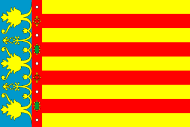</td>
  </tr>
  <tr>
    <td>Valladolid
</td>
    <td>Vizcaya
</td>
    <td>Zamora
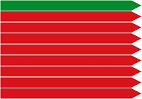</td>
    <td>Zaragoza
</td>
  </tr>  
</table>
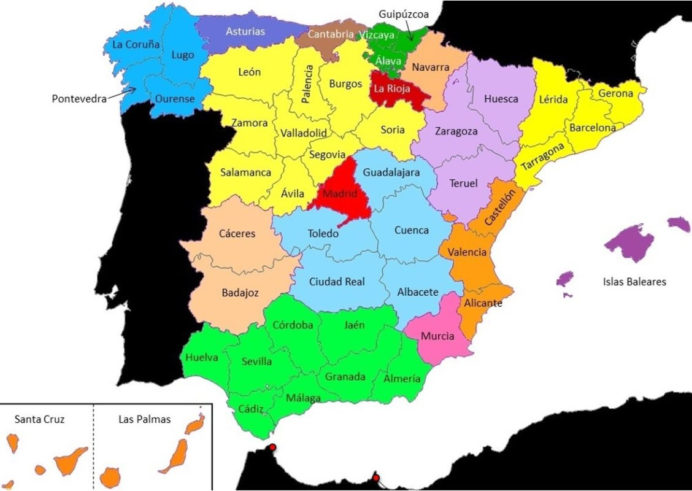

        (01) Las siglas provinciales son oficiales por Real Orden de 24/05/1907.
             El Reglamento de vehículos de 17/09/1900 ya obligaba a crear un registro provincial,
             aunque no determinó un criterio fijo y uniforme; por lo que la numeración e identificación
             de los vehículos no estuvo normalizada hasta 1907.
        (02) Navarra cambia su contraseña de PA a NA, por RD de 23/07/1918.
        (03) Cáceres cambia su contraseña de CAC a CC, por RD de 23/07/1918.
        (04) Baleares cambia su contraseña de PM a BA, por RD de 23/07/1918,
             aunque no se llegó a aplicar por su confusión con las siglas de Badajoz (BA).
             Por RD de 16/06/1926 se cambia nuevamente de BA a PM.
        (05) Albacete cambia su contraseña de ALB a AB, por RD de 16/06/1926.
        (06) Castellón cambia su contraseña de CAS a CS, por RD de 16/06/1926.
        (07) Segovia cambia su contraseña de SEG a SG, por RD de 16/06/1926.
        (08) Teruel cambia su contraseña de TER a TE, por RD de 16/06/1926.
        (09) Ceuta y Melilla, tienen como contraseña CE y ML, respectivamente,
             por RD de 16/06/1926. Ya se utilizaban desde 1922 y 1917.
        (10) En 1927, la provincia de Canarias (TE, desde 1907) se separa en dos provincias
             por RD 21/09/1927: Las Palmas de Gran Canaria y Santa Cruz de Tenerife.
             Sus contraseñas van a ser GC y TF, respectivamente, por RD de 16/06/1926.

        (11) Gerona/Girona cambia su contraseña de GE a GI, por RD de 29/05/1992.
        (12) Baleares/Illes Balears cambia su contraseña de PM a IB, por RD de 18/07/1997.
        (13) Orense/Ourense cambia su contraseña de OR a OU, por RD de 31/07/1998.
        (14) La Rioja aprueba el cambio de LO a LR para que entrara en vigor el 18/09/2000 pero con la anulación de las siglas provinciales, esto nunca llegó a suceder.
